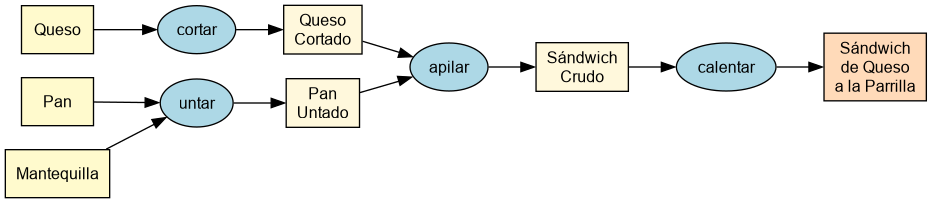

# Introducción

Este documento ejemplifica la estructura de un "informe del E". También les sirve como _template_. Está en formato Markdown y se compila con `panduck`, que necesita tener instalados `pandoc`, `pandoc-crossref` y una distribución de `XeLaTeX`. Para compilarlo:

```
panduck build -p dcc-informe main.md
```

Primero, quiero motivarles a escribir. ¿Les gusta escribir? He hecho esa pregunta antes, y la respuesta suele ser "NO". También he preguntado: ¿Les gusta programar? Y la respuesta suele ser "SÍ". 

Luego pregunto: ¿A qué pertenecen estos conceptos, escribir o programar?

* Lenguaje
* Sintaxis
* Morfología
* Estructura
* Audiencia.

Es ahí cuando se dan cuenta de que ${escribir, programar}$ es formalizar la estructura de lo que queremos ${comunicar, ejecutar}$. A mi juicio, son procesos similares. Así que si no le temes a programar, te recomiendo perderle el miedo a escribir.

Volvamos a lo nuestro: el informe del E. Tiene las mismas secciones que este documento. En este caso, nos encontramos en la **Introducción**. Esta sección tiene un estilo narrativo, cuyo propósito es motivar el proyecto. Si estás leyendo esto, probablemente lo estás haciendo bajo mi tutela (yo $=$ Eduardo Graells-Garrido). Y, por lo mismo, quizás no te he dado un problema del todo definido, sino que espero que tú definas el proyecto: yo te he dado los límites de un territorio y un problema como punto de partida, pero tú debes definir hacia dónde llegar (la solución) y cuál es el camino a seguir (la hoja de ruta). Para definir un problema y definir una hoja de ruta, sugiero seguir una estrategia que sea enriquecedora [@alon2009choose].

Ahora bien, independiente del estilo, recomiendo escribir siguiendo el principio piramidal [@minto2009pyramid]. Y nunca está de más seguir consejos generales [@gu2007ten].

Vamos al grano. ¿Qué poner en esta sección? Al menos:

1. Un párrafo con la _situación_ actual (en tanto _situación_ se refiere a la del principio piramidal: el contexto del proyecto).
2. Un párrafo con la _complicación_ (la problemática a resolver).
3. Un párrafo con la _propuesta_ (¿qué es lo que hará tu solución? Nota que se pregunta el qué, no el cómo).

## Situación actual

Esta sección tiene un estilo descriptivo, cuyo propósito es dejar claros los límites de lo disponible. Es decir, debes tener lo siguiente:

1. Un párrafo extendido respecto a la _situación_ actual (el de la sección anterior es solo una motivación.
2. Descripciones de soluciones a problemáticas similares. No es necesario que el problema que presentas sea novedoso, pero sí tiene que quedar claro qué se ha hecho al respecto, también dónde y cuándo.
3. Un diagnóstico que te permita justificar por qué es necesaria una nueva solución para esa problemática.

## Objetivos

Esta sección define el destino de tu proyecto. Tiene una estructura jerárquica: primero un objetivo general (el destino), luego un conjunto de objetivos específicos (los puntos intermedios del viaje). Además debes decir cómo determinarás que cada objetivo se ha cumplido. 

### Objetivo general

El objetivo general de tu proyecto es una descripción de dónde quieres estar luego que el proceso ha culminado. No debiese ser algo del tipo "Desarrollar un sistema...", porque eso es el cómo vas a lograrlo. Sino más bien algo como:

> Predecir la variable $X$ utilizando los datos $D$ dadas las condiciones $C$.

### Objetivos específicos

Aquí debes escribir una lista de objetivos específicos. ¿Cómo definirlos? No son tareas a realizar, sino que son pasos del proceso o camino necesario para cumplir tu objetivo general. Ponlos en una lista enumerada, así podrás referenciarlos como Objetivo Específico 1, OE 2, OE3, etc.

Si el objetivo general es "Predecir la variable $X$ utilizando los datos $D$ dadas las condiciones $C$", entonces los objetivos específicos pueden ser:

1. Disponer del _dataset_ $D$ en una base de datos estructurada.
2. Verificar las condiciones $C$ usando el *framework* $F$.
3. Instanciar un modelo de clasificación basado en árboles que prediga la variable $X$.

Nota que esto dice lo que haras, pero no el cómo. ¿Cuál es la base de datos? No se dice. ¿Cómo lo verificarás? Se utiliza solamente un concepto de alto nivel. ¿Cuál modelo se usará? Quizás puedas decir el nombre de una familia de modelos, pero no estás diciendo cuáles son sus parámetros.

### Evaluación

Aquí describes cómo podrás saber si cada objetivo se cumplió de manera satisfactoria. Por ejemplo, OE1 se verifica con una instalación funcionando en una máquina que controles. OE2 se verifica contrastando los resultados del _framework_ con una guía de referencia. OE3 se verifica con una validación cruzada, donde la precisión esperada es sobre 0.8.

## Solución propuesta

Esta sección describe lo que realizarás. Ahora sí debes especificar cómo hacerlo. Por lo mismo, tiene un estilo descriptivo cuyo propósito es dejar clara la manera de alcanzar sus objetivos. Para ello, te recomiendo que escribas una lista de tareas a realizar. Las puedes agrupar por objetivos específicos, de modo que las describas en el orden que necesitas ejecutarlas para cumplir con cada objetivo.

Aprovecharé que aquí podemos extendernos para darte algunos conceptos de escritura. Al igual que en la computación, hay tres maneras de trabajar que te recomiendo seguir:

* **Iterar**. Debes escribir de manera incremental, aumentando detalles y reorganizando el texto a medida que lo presentamos y comentamos. Por ejemplo, en vez de escribir un párrafo puedes escribir solo una línea que explique lo que contiene el párrafo. En la siguiente iteración la expandes.
* **Modularizar**. Debes definir qué es lo que contiene cada capítulo/sección/párrafo y en qué orden. Este documento contiene una estructura base, pero no puedo adelantarme al contenido puesto que dependerá de tu proyecto. 
* **Dividir para conquistar**. ¡No es necesario que termines todo el documento de una vez! Podemos iterar/modularizar/terminar por partes, que puedes priorizar en el camino.

No es fácil escribir. Tampoco es fácil programar. Menos lo es diseñar e implementar sistemas: recuerda que tu trabajo como ingeniero, ingeniera o ingeniere es diseñar, implementar y comunicar. 

También es buena idea esquematizar de manera gráfica. Ayuda a entender tanto a quien lee el informe como a quien lo está escribiendo `;)`. La Figura [-@fig:diagrama] contiene un diagrama _random_ pero que muestra el estilo de esquema que me parece adecuado para un proyecto. Fue generado con el programa `dot` de la suite Graphviz [@ellson2002graphviz].

{#fig:diagrama width=30%}

Lo interesante es que `dot` es también un lenguaje, es decir, tú _escribes_ el diagrama. La Figura [-@fig:diagrama] utiliza el siguiente código fuente:

```
digraph G {

  subgraph cluster_0 {
    style=filled;
    color=lightgrey;
    node [style=filled,color=white];
    a0 -> a1 -> a2 -> a3;
    label = "process #1";
  }

  subgraph cluster_1 {
    node [style=filled];
    b0 -> b1 -> b2 -> b3;
    label = "process #2";
    color=blue
  }
  start -> a0;
  start -> b0;
  a1 -> b3;
  b2 -> a3;
  a3 -> a0;
  a3 -> end;
  b3 -> end;

  start [shape=Mdiamond];
  end [shape=Msquare];
}
```

Este código lo obtuve desde un compilador en Javascript de archivos `.dot`^[Disponible aquí: <https://dreampuf.github.io/GraphvizOnline/>. También me sirve este texto para mostrarte cómo se agregan notas al pie.].

Nota que al ingresar una imagen en Markdown el identificador de la figura es el primer atributo (en este caso: `#fig:diagrama`), pero al referenciarla no utilizamos el carácter `#` (que la define) sino el carácter `@` (que la referencia). La referencia se escribe `[-@fig:diagrama]`: el signo `-` omite el prefijo automático, porque la palabra "Figura" ya está escrita en el texto.

El archivo `sandwich.dot` contiene otro diagrama (Figura [-@fig:sandwich]), que ejemplifica el proceso de hacer un pan con queso derretido^[Gracias a Michele Tobias por la idea: <https://bsky.app/profile/micheletobias.bsky.social/post/3ln24iiqijk2p>.]. Este es un buen ejemplo de cómo documentar un proceso: tiene las entradas, los pasos intermedios, y el resultado final.

{#fig:sandwich width=100%}

Lee el archivo `Makefile` para ver cómo convertir los archivos `.dot` en imágenes (en este caso, `.png`).

## Plan de trabajo

La sección anterior define lo que harás en términos de *tareas*. Esta sección define cuándo ejecutarás cada una y cuánto tiempo debería tomar. Lo expresas a través de una tabla Gantt que cubra todo el semestre del F (aprox. 16 semanas). La Tabla [-@tbl:gantt] tiene un ejemplo.

Table: Carta Gantt. {#tbl:gantt}

| Tarea                                                                    | Mes 1  | Mes 2  | Mes 3  | Mes 4  |
| ------------------------------------------------------------------------ | ------ | ------ | ------ | ------ |
| Una tarea                                                                | `XXXX` |        |        |        |
| Otra tarea                                                               | `XXXX` | `XX␣␣` |        |        |
| Cada tarea es lo más específica posible                                  | `␣␣␣X` | `XXXX` |        |        |
| Algunas pueden tener pausas...                                           |        | `␣␣XX` | `XX␣␣` |        |
| ... o interrupciones                                                     |        | `␣X␣X` | `␣X␣X` | `XX␣␣` |
| Lo importante es que cubran todo el tiempo y muestren un plan de acción. |        |        | `XXXX` | `XX␣X` |

Es importante hacer esta tabla. Porque te permite visualizar el tiempo que dispones y así acotar las tareas a realizar.

Como último consejo: algo común en el departamento es que terminamos todo a última hora. Eso no está mal, pero es estresante y riesgoso. El secreto para lograrlo con el menor estrés posible es comenzar mucho antes.

## Trabajo adelantado

Esta sección debe ir en el informe final del E, pero no es necesaria en el primer informe. Aunque si hay algo que tengan avanzando, por ej., por un trabajo previo en un proyecto relacionado, o bien si ya hay avances que puedan reportar, este es un lugar adecuado para hacerlo. ¡Siempre es bueno tener trabajo adelantado!

\section*{Bibliografía}

La bibliografía se genera automáticamente a partir de las citas que pusiste en el documento con formato `[@llave-de-referencia]`. Debes poner cada entrada en el archivo `references.bib` siguiendo el formato de _BiBTeX_.

<div id="refs"></div>

\appendix

# Apéndice

Aquí hay ejemplos de ecuaciones y código. En general, el código de tu proyecto no debiese ir en el cuerpo central a menos que sea relevante para explicar cómo implementaste algo.

## Uso de fórmulas matemáticas

En tu informe, frecuentemente necesitarás expresar conceptos mediante fórmulas matemáticas:

* Ecuaciones en línea: Si quieres expresar algo como la media aritmética $\bar{x} = \frac{1}{n}\sum_{i=1}^{n}x_i$ dentro de un párrafo, utiliza símbolos `$` alrededor de la ecuación.
* Ecuaciones destacadas: Para fórmulas más complejas que merecen su propio espacio, usa `$$`:
$$F(x) = \int_{a}^{b} f(t) \, dt$$

Un ejemplo: en un modelo de regresión lineal múltiple, podríamos expresar la relación entre variables como:
$$y_i = \beta_0 + \beta_1 x_{i1} + \beta_2 x_{i2} + ... + \beta_p x_{ip} + \varepsilon_i,$$
donde:

- $y_i$ es la variable dependiente
- $x_{ij}$ son las variables independientes
- $\beta_j$ son los coeficientes de regresión
- $\varepsilon_i$ es el término de error aleatorio.

También puedes presentar sistemas de ecuaciones:

$$\begin{cases}
a_1x + b_1y + c_1z = d_1 \\
a_2x + b_2y + c_2z = d_2 \\
a_3x + b_3y + c_3z = d_3
\end{cases}$$

## Código

Para incluir código se utilizan las _backticks_ o `` ` ``. Para tener código en una línea, encierras el código en apóstrofes reversos simples. Lo que luce `hola("mundo")` se escribe así:

```
`hola("mundo")`
```

Y para escribir código en su propio bloque debes iniciar una línea con tres apóstrofes reversos ` ``` `, poner tu código debajo, y después de la última línea poner tres apóstrofes de nuevo. El código se ve así:

```
# Algoritmo K-means
# Input: K (número de clusters), D (conjunto de datos)
# Output: Asignación de clusters

centroides = inicializar_aleatorio(K, D)

while not converge:
    # Asignar cada punto al cluster más cercano
    clusters = {}
    for x_i in D:
        cluster_mas_cercano = min(range(K), 
            key=lambda j: distancia(x_i, centroides[j]))
        clusters.setdefault(cluster_mas_cercano, []).append(x_i)
    
    # Actualizar centroides
    for j in range(K):
        if j in clusters:
            centroides[j] = calcular_media(clusters[j])
    
    # Verificar convergencia
    if cambio_en_centroides <= umbral:
        break

return clusters
```

Como utilizamos la tipografía _Fira Code_, hay elementos que se ven de manera especial, como `<=`.