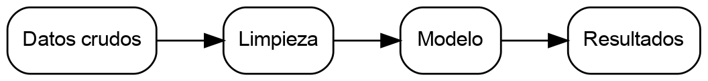

# Introducción

El estilo Tufte deja la columna de texto angosta y reserva un margen ancho a la derecha. Ahí van las notas, de modo que el lector las encuentra a la altura de la línea que las llama, sin saltar al pie ni al final del documento.

Las notas al pie de markdown se convierten en notas al margen numeradas.^[Esta nota se escribió con la sintaxis `^[...]` y salió al margen. Las notas con referencia diferida (`[^1]`) funcionan igual.] Cita con la sintaxis `[@clave]`, donde `clave` es la entrada en `references.bib` [@tufte2001visual].

::: margin
Un bloque `::: margin` va al margen sin número. Sirve para comentarios sueltos, definiciones breves y figuras marginales.
:::

# Métodos

Las ecuaciones inline llevan un espacio antes y otro después, por ejemplo $y = \beta_0 + \beta_1 x + \varepsilon$ . Las ecuaciones destacadas van en su propio bloque y se referencian con el prefijo suprimido, porque la palabra "Ecuación" ya va escrita a mano:

$$\hat{\beta} = (X^\top X)^{-1} X^\top y.$$ {#eq:ols}

La Ecuación [-@eq:ols] es el estimador de mínimos cuadrados.

# Resultados

La Figura [-@fig:flujo] resume el orden de las etapas.

{#fig:flujo width=100%}

::: margin

:::

Una tabla angosta cabe en la columna de texto: la Tabla [-@tbl:coeficientes] resume los coeficientes.

Table: Coeficientes del modelo. {#tbl:coeficientes}

| Variable | Coeficiente | IC 95%         |
| -------- | ----------- | -------------- |
| $x_1$    | 0.42        | [0.31, 0.53]   |
| $x_2$    | -0.18       | [-0.27, -0.09] |

Cuando una tabla o una figura no cabe, `::: wide` la extiende sobre el margen.

::: wide
Table: Comparación de los tres modelos ajustados. {#tbl:modelos}

| Especificación del modelo   | Predictores | $R^2$ ajustado | RMSE      | AIC       | Observaciones | Validación cruzada |
| --------------------------- | ----------- | -------------- | --------- | --------- | ------------- | ------------------ |
| Base, sin controles         | 2           | 0.31           | 1.42      | 812.4     | 1200          | 5 particiones      |
| Con controles demográficos  | 6           | 0.48           | 1.18      | 764.1     | 1200          | 5 particiones      |
| Completo, con interacciones | 11          | 0.52           | 1.11      | 759.8     | 1200          | 10 particiones     |
:::

# Discusión

Interpreta los hallazgos y conéctalos con la brecha que planteaste en la introducción. Indica los límites del estudio.

# Referencias {.unnumbered}

::: {#refs}
:::
